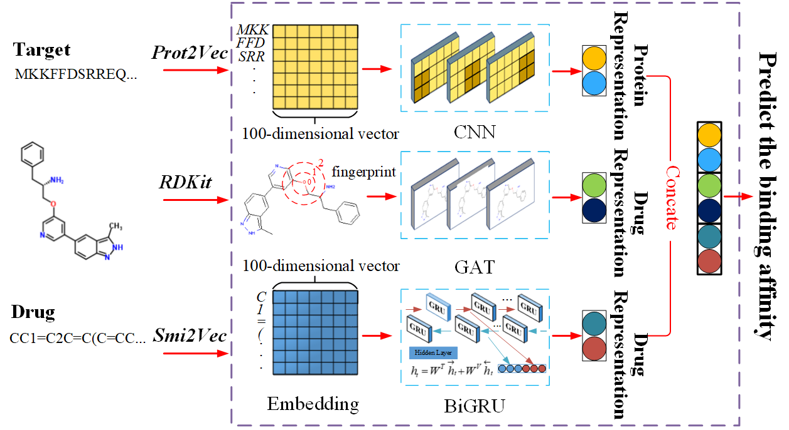

<h1>DeepGS</h1>

Source Code Repository for DeepGS: Deep Representation Learning of Graphs and Sequences for Drug-Target Binding Affinity Prediction. Please refer to [our paper](http://ecai2020.eu/papers/34_paper.pdf) for detailed ([ECAI 2020](http://ecai2020.eu/) will be held soon )


<h1>Installation</h1>

```bash
conda create -n deepgs python=3.7.6
source activate deepgs
git clone https://github.com/jacklin18/DeepGS.git  
cd DeepGS  
pip install -r requirements.txt
```

<h1>Requirements</h1>

* [Pytorch](https://pytorch.org/)
* [RDKit](http://www.rdkit.org/docs/Install.html#how-to-install-rdkit-with-conda)
* scikit-learn
* Keras

<h1>Data</h1>

Please see the [DeepDTA](https://github.com/hkmztrk/DeepDTA) for detailed information.
In order to train the DeepGS model, you must provide training data with each row contains a molecule (i.e., SMILES strings), a protein sequence (i.e., amino acids) and a label between the drug-target pair (i.e., binding affinity value). For example: 

```bash
CC1=C2C=C(C=CC2=NN1)C3=CC(=CN=C3)OCC(CC4=CC=CC=C4)N MKKFFDSRREQGGSGLGSGSSGGGGSTSGLGSGYIGRVFGIGRQQVTVDEVLAEGGFAIVFLVRTSNGMKCALKRMFVNNEHDLQVCKREIQIMRDLSGHKNIVGYIDSSINNVSSGDVWEVLILMDFCRGGQVVNLMNQRLQTGFTENEVLQIFCDTCEAVARLHQCKTPIIHRDLKVENILLHDRGHYVLCDFGSATNKFQNPQTEGVNAVEDEIKKYTTLSYRAPEMVNLYSGKIITTKADIWALGCLLYKLCYFTLPFGESQVAICDGNFTIPDNSRYSQDMHCLIRYMLEPDPDKRPDIYQVSYFSFKLLKKECPIPNVQNSPIPAKLPEPVKASEAAAKKTQPKARLTDPIPTTETSIAPRQRPKAGQTQPNPGILPIQPALTPRKRATVQPPPQAAGSSNQPGLLASVPQPKPQAPPSQPLPQTQAKQPQAPPTPQQTPSTQAQGLPAQAQATPQHQQQLFLKQQQQQQQPPPAQQQPAGTFYQQQQAQTQQFQAVHPATQKPAIAQFPVVSQGGSQQQLMQNFYQQQQQQQQQQQQQQLATALHQQQLMTQQAALQQKPTMAAGQQPQPQPAAAPQPAPAQEPAIQAPVRQQPKVQTTPPPAVQGQKVGSLTPPSSPKTQRAGHRRILSDVTHSAVFGVPASKSTQLLQAAAAEASLNKSKSATTTPSGSPRTSQQNVYNPSEGSTWNPFDDDNFSKLTAEELLNKDFAKLGEGKHPEKLGGSAESLIPGFQSTQGDAFATTSFSAGTAEKRKGGQTVDSGLPLLSVSDPFIPLQVPDAPEKLIEGLKSPDTSLLLPDLLPMTDPFGSTSDAVIEKADVAVESLIPGLEPPVPQRLPSQTESVTSNRTDSLTGEDSLLDCSLLSNPTTDLLEEFAPTAISAPVHKAAEDSNLISGFDVPEGSDKVAEDEFDPIPVLITKNPQGGHSRNSSGSSESSLPNLARSLLLVDQLIDL 43.0
...
```

<h1>Usage</h1>
(i) preprocess data as input

```bash
cd code
sh/bash preprocess.sh
```

(ii) train the model

```bash
sh/bash run_tranining.sh
```

<h1>Citation</h1>

If you use the code of DeepGS, please cite the [paper](http://ecai2020.eu/papers/34_paper.pdf) below:

> @inproceedings{lin2020deepgs,  
title ={DeepGS: Deep Representation Learning of Graphs and Sequences for Drug-Target Binding Affinity Prediction},  
author ={Lin, Xuan and Zhao, Kaiqi and Xiao, Tong and Quan, Zhe and Wang, Zhi-Jie and Yu, Philip S},  
booktitle ={24th European Conference on Artificial Intelligence (ECAI)},  
pages ={1--8},  
year ={2020}  
}
